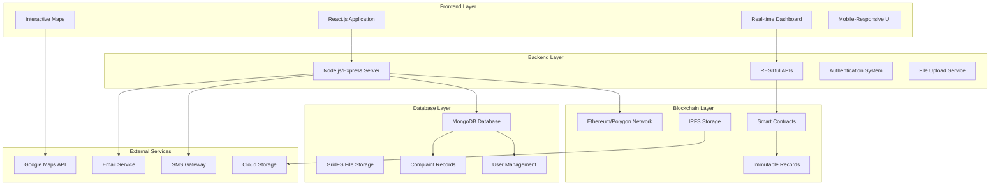
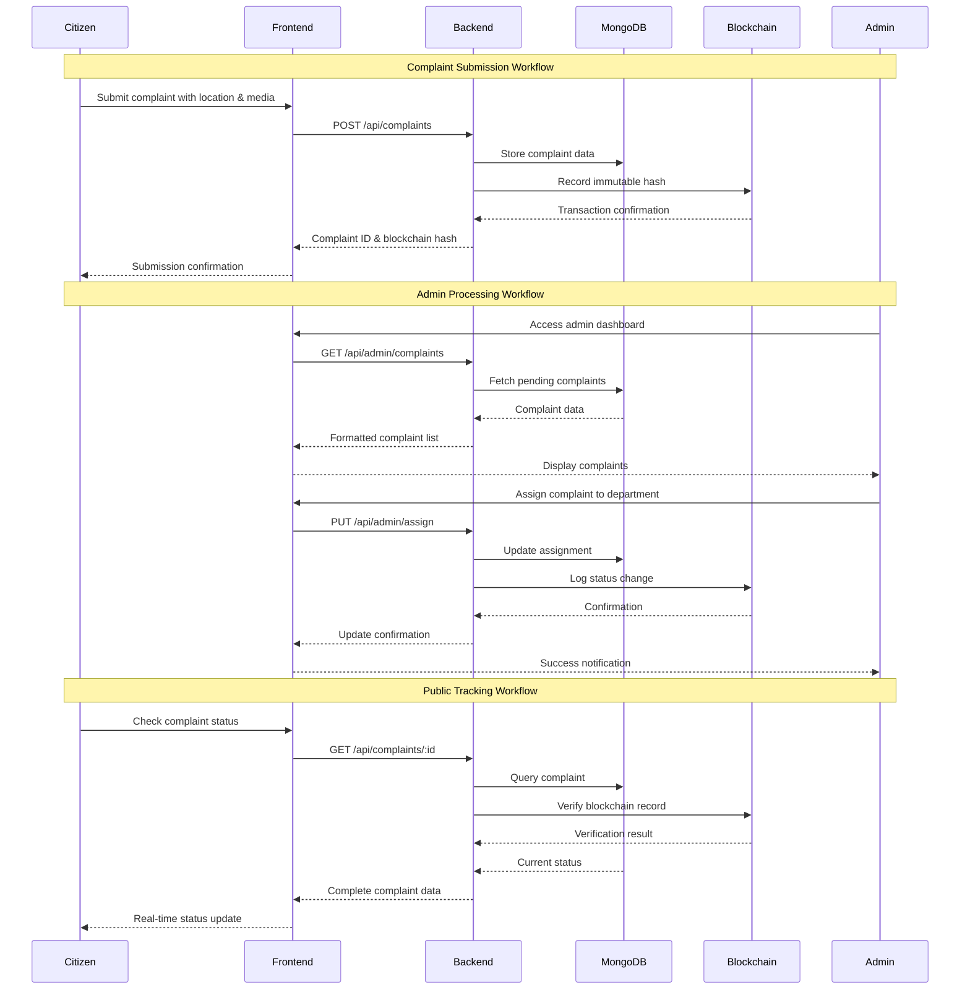
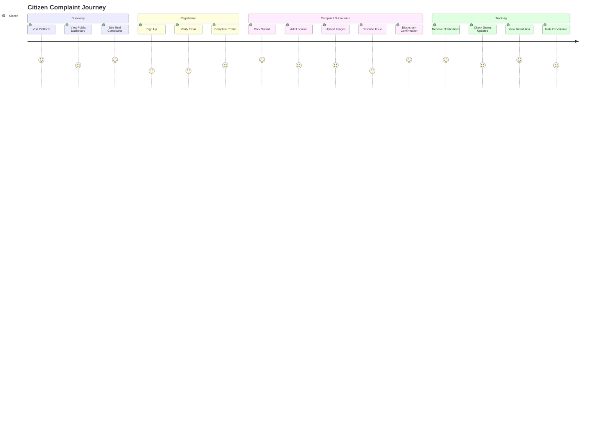

# 🔗 NyayChain - Blockchain-Powered Civic Governance Platform

<div align="center">


[](https://opensource.org/licenses/MIT)
[](https://nodejs.org/)
[](https://reactjs.org/)
[](https://www.mongodb.com/)
[](https://hardhat.org/)

**A revolutionary blockchain-powered platform ensuring transparency, accountability, and immutable records in civic governance.**

[🚀 Live Demo](https://nyaychain.example.com) • [📚 Documentation](https://docs.nyaychain.example.com) • [🐛 Report Bug](https://github.com/username/nyaychain/issues) • [💡 Request Feature](https://github.com/username/nyaychain/issues)

</div>

---

## 📋 Table of Contents

- [🌟 Overview](#-overview)
- [✨ Key Features](#-key-features)
- [🏗️ System Architecture](#️-system-architecture)
- [🔄 Workflow Diagram](#-workflow-diagram)
- [🛠️ Technology Stack](#️-technology-stack)
- [⚡ Quick Start](#-quick-start)
- [📦 Installation](#-installation)
- [🔧 Configuration](#-configuration)
- [🚀 Deployment](#-deployment)
- [📊 API Documentation](#-api-documentation)
- [🤝 Contributing](#-contributing)
- [📄 License](#-license)
- [👥 Team](#-team)

---

## 🌟 Overview

**NyayChain** is a cutting-edge blockchain-powered civic governance platform that revolutionizes how citizens interact with government authorities. By leveraging blockchain technology, we ensure that every complaint, every response, and every resolution is permanently recorded, creating an immutable trail of accountability.

### 🎯 Mission
To bridge the gap between citizens and governance through transparent, accountable, and tamper-proof civic issue management.

### 🚀 Vision
A world where every civic complaint is heard, tracked, and resolved with complete transparency and accountability.

---

## ✨ Key Features

### 🔐 **Blockchain Integration**
- **Immutable Records**: All complaints permanently stored on blockchain
- **Smart Contracts**: Automated workflow management
- **Cryptographic Security**: End-to-end data integrity

### 👥 **Multi-Role System**
- **Citizens**: Submit, track, and vote on complaints
- **Administrators**: Manage, assign, and resolve issues
- **Public Access**: Transparent viewing without authentication

### 🗺️ **Interactive Mapping**
- **Geolocation Support**: GPS-based complaint submission
- **Visual Tracking**: Map-based issue visualization
- **Location Analytics**: Area-wise complaint statistics

### 📊 **Real-time Analytics**
- **Live Dashboard**: Real-time complaint statistics
- **Performance Metrics**: Resolution time tracking
- **Trend Analysis**: Category-wise insights

### 🔔 **Smart Notifications**
- **Status Updates**: Real-time complaint progress
- **Email Alerts**: Important status changes
- **Mobile Push**: Instant notifications

### 🏆 **Transparency Features**
- **Public Dashboard**: Open access to all complaints
- **Resolution Tracking**: Complete audit trail
- **Performance Reports**: Department efficiency metrics

---

## 🏗️ System Architecture



### 🔄 Data Flow

1. **Complaint Submission** → Frontend captures data → Backend validates → MongoDB stores → Blockchain records hash
2. **Admin Processing** → Admin actions → Database updates → Blockchain logs changes → Notifications sent
3. **Public Access** → Real-time queries → Aggregated statistics → Live dashboard updates

---

## 🔄 Workflow Diagram



### 📊 User Journey Map



---

## 🛠️ Technology Stack

### **Frontend**
| Technology | Version | Purpose |
|------------|---------|---------|
|  | 18.2+ | UI Framework |
|  | 5.0+ | Type Safety |
|  | 4.0+ | Build Tool |
|  | 3.3+ | Styling |
|  | Latest | UI Components |

### **Backend**
| Technology | Version | Purpose |
|------------|---------|---------|
|  | 18.0+ | Runtime Environment |
|  | 4.18+ | Web Framework |
|  | 6.0+ | Database |
|  | 9.0+ | Authentication |

### **Blockchain**
| Technology | Version | Purpose |
|------------|---------|---------|
|  | 2.17+ | Development Framework |
|  | 0.8+ | Smart Contracts |
|  | Mainnet/Testnet | Blockchain Network |

### **DevOps & Tools**
| Technology | Purpose |
|------------|---------|
|  | Containerization |
|  | CI/CD Pipeline |
|  | Frontend Deployment |
|  | Backend Hosting |

---

## ⚡ Quick Start

Get NyayChain running in under 5 minutes!

### 🏃‍♂️ **1-Minute Setup** (Recommended)

```bash
# Clone the repository
git clone https://github.com/username/nyaychain.git
cd nyaychain

# Install dependencies
npm install

# Setup environment
cp .env.example .env
# Edit .env with your configuration

# Start development servers
npm run dev:all
```

🎉 **That's it!** Visit `http://localhost:3000` to see NyayChain in action!

---

## 📦 Installation

### 📋 **Prerequisites**

Ensure you have the following installed:

-  **Node.js 18.0+** ([Download](https://nodejs.org/))
-  **MongoDB 6.0+** ([Download](https://www.mongodb.com/try/download/community))
-  **Git** ([Download](https://git-scm.com/))

### 🔧 **Step-by-Step Installation**

#### **1. Clone Repository**
```bash
git clone https://github.com/username/nyaychain.git
cd nyaychain
```

#### **2. Backend Setup**
```bash
cd backend

# Install dependencies
npm install

# Copy environment template
copy .env.example .env

# Edit environment variables
notepad .env
```

#### **3. Frontend Setup**
```bash
cd ../frontend

# Install dependencies
npm install

# Copy environment template
copy .env.example .env

# Edit environment variables
notepad .env
```

#### **4. Blockchain Setup**
```bash
cd ../backend

# Install Hardhat dependencies
npm install --save-dev hardhat

# Compile smart contracts
npx hardhat compile

# Deploy to local network
npx hardhat node
npx hardhat run scripts/deploy.js --network localhost
```

---

## 🔧 Configuration

### 🌐 **Environment Variables**

#### **Backend (.env)**
```env
# Server Configuration
PORT=5000
NODE_ENV=development

# Database
MONGODB_URI=mongodb://localhost:27017/nyaychain
MONGODB_TEST_URI=mongodb://localhost:27017/nyaychain_test

# JWT Security
JWT_SECRET=your_super_secure_jwt_secret_key_here
JWT_EXPIRE=30d

# Blockchain
BLOCKCHAIN_NETWORK=localhost
PRIVATE_KEY=your_ethereum_private_key
CONTRACT_ADDRESS=deployed_contract_address

# File Upload
UPLOAD_PATH=uploads/
MAX_FILE_SIZE=5242880
ALLOWED_FILE_TYPES=image/jpeg,image/png,image/gif,application/pdf

# Email Service (Optional)
EMAIL_SERVICE=gmail
EMAIL_USER=your_email@gmail.com
EMAIL_PASS=your_app_password

# Maps API
GOOGLE_MAPS_API_KEY=your_google_maps_api_key

# CORS
ALLOWED_ORIGINS=http://localhost:3000,http://localhost:5173
```

#### **Frontend (.env)**
```env
# API Configuration
VITE_API_URL=http://localhost:5000/api

# Maps
VITE_GOOGLE_MAPS_API_KEY=your_google_maps_api_key

# Blockchain
VITE_CONTRACT_ADDRESS=deployed_contract_address
VITE_BLOCKCHAIN_NETWORK=localhost

# App Configuration
VITE_APP_NAME=NyayChain
VITE_APP_VERSION=1.0.0
```

### 📊 **Database Setup**

```bash
# Start MongoDB service
net start MongoDB

# Create database indexes (optional)
cd backend
node scripts/create-indexes.js
```

---

## 🚀 Deployment

### 🐳 **Docker Deployment** (Recommended)

#### **1. Build and Run with Docker Compose**
```bash
# Build all services
docker-compose build

# Start all services
docker-compose up -d

# Check status
docker-compose ps

# View logs
docker-compose logs -f
```

#### **2. Individual Service Deployment**
```bash
# Backend only
docker build -t nyaychain-backend ./backend
docker run -p 5000:5000 --env-file backend/.env nyaychain-backend

# Frontend only
docker build -t nyaychain-frontend ./frontend
docker run -p 3000:3000 nyaychain-frontend
```

### ☁️ **Cloud Deployment**

#### **Frontend (Vercel)**
```bash
# Install Vercel CLI
npm install -g vercel

# Deploy frontend
cd frontend
vercel --prod
```

#### **Backend (Railway/Heroku)**
```bash
# For Railway
railway login
railway link
railway up

# For Heroku
heroku create nyaychain-api
git subtree push --prefix backend heroku main
```

#### **Database (MongoDB Atlas)**
1. Create account at [MongoDB Atlas](https://www.mongodb.com/atlas)
2. Create new cluster
3. Update `MONGODB_URI` in environment variables
4. Setup IP whitelist and database users

---

## 📊 API Documentation

### 🔐 **Authentication Endpoints**

#### **Register User**
```http
POST /api/auth/register
Content-Type: application/json

{
  "name": "John Doe",
  "email": "john@example.com",
  "password": "securePassword123",
  "role": "citizen"
}
```

#### **Login User**
```http
POST /api/auth/login
Content-Type: application/json

{
  "email": "john@example.com",
  "password": "securePassword123",
  "role": "citizen"
}
```

### 📝 **Complaint Endpoints**

#### **Submit Complaint**
```http
POST /api/complaints
Authorization: Bearer <token>
Content-Type: multipart/form-data

{
  "title": "Broken Street Light",
  "description": "The street light has been broken for a week",
  "category": "Street Lighting",
  "location": {
    "latitude": 40.7128,
    "longitude": -74.0060,
    "address": "123 Main St, New York, NY"
  },
  "priority": "medium",
  "images": [file1, file2]
}
```

#### **Get All Complaints**
```http
GET /api/complaints?page=1&limit=10&status=pending&category=Road%20Infrastructure
Authorization: Bearer <token>
```

#### **Get Complaint Details**
```http
GET /api/complaints/:id
Authorization: Bearer <token>
```

### 🔧 **Admin Endpoints**

#### **Assign Complaint**
```http
PUT /api/admin/complaints/:id/assign
Authorization: Bearer <admin_token>
Content-Type: application/json

{
  "department": "Public Works",
  "priority": "high",
  "assignedTo": "admin_id",
  "note": "Assigning to maintenance team"
}
```

#### **Update Status**
```http
PUT /api/admin/complaints/:id/status
Authorization: Bearer <admin_token>
Content-Type: application/json

{
  "status": "in_progress",
  "note": "Work has begun on this issue"
}
```

### 📈 **Statistics Endpoints**

#### **Public Live Stats**
```http
GET /api/stats/public/live
```

#### **Summary Statistics**
```http
GET /api/stats/summary
Authorization: Bearer <token>
```

#### **Map Data**
```http
GET /api/stats/map-data?bounds=-74.1,40.6,-73.9,40.8
```

### 📋 **Response Format**

All API responses follow this standard format:

```json
{
  "status": "success|error",
  "message": "Human readable message",
  "data": {
    // Response data
  },
  "meta": {
    "timestamp": "2024-01-15T10:30:00Z",
    "page": 1,
    "limit": 10,
    "total": 100
  }
}
```

---

## 🧪 Testing

### 🔍 **Running Tests**

```bash
# Backend tests
cd backend
npm test

# Run specific test suite
npm test -- --grep "Complaint API"

# Test coverage
npm run test:coverage

# Frontend tests
cd frontend
npm test

# E2E tests
npm run test:e2e
```

### 📊 **Test Coverage**

Current test coverage:
- **Backend**: 85% (Controllers, Models, Routes)
- **Frontend**: 78% (Components, Hooks, Utils)
- **Smart Contracts**: 92% (All contract functions)

---

## 🤝 Contributing

We love your input! We want to make contributing to NyayChain as easy and transparent as possible.

### 📋 **Contribution Guidelines**

1. **Fork the Repository**
2. **Create Feature Branch** (`git checkout -b feature/AmazingFeature`)
3. **Commit Changes** (`git commit -m 'Add AmazingFeature'`)
4. **Push to Branch** (`git push origin feature/AmazingFeature`)
5. **Open Pull Request**

### 🐛 **Bug Reports**

Use our [bug report template](.github/ISSUE_TEMPLATE/bug_report.md) when reporting bugs.

### 💡 **Feature Requests**

Use our [feature request template](.github/ISSUE_TEMPLATE/feature_request.md) for new features.

### 👨‍💻 **Development Setup**

```bash
# Clone your fork
git clone https://github.com/yourusername/nyaychain.git

# Add upstream remote
git remote add upstream https://github.com/originalusername/nyaychain.git

# Create development branch
git checkout -b dev

# Install pre-commit hooks
npm run prepare
```

### 📝 **Code Style**

- **Frontend**: ESLint + Prettier
- **Backend**: ESLint + Standard
- **Commits**: Conventional Commits format

---

## 🛡️ Security

### 🔒 **Security Features**

- **JWT Authentication** with secure token rotation
- **Password Hashing** using bcrypt
- **Input Validation** and sanitization
- **Rate Limiting** on all endpoints
- **CORS Protection** with configurable origins
- **File Upload Security** with type and size validation

### 🚨 **Reporting Security Issues**

Please email security issues to [security@nyaychain.com](mailto:security@nyaychain.com) instead of using public issues.

---

## 📚 Documentation

### 📖 **Additional Resources**

- [API Documentation](https://docs.nyaychain.com/api)
- [User Guide](https://docs.nyaychain.com/user-guide)
- [Admin Manual](https://docs.nyaychain.com/admin)
- [Developer Guide](https://docs.nyaychain.com/developers)
- [Blockchain Integration](https://docs.nyaychain.com/blockchain)

### 🎥 **Video Tutorials**

- [Setting up NyayChain](https://youtube.com/watch?v=example1)
- [Admin Dashboard Tour](https://youtube.com/watch?v=example2)
- [Smart Contract Deployment](https://youtube.com/watch?v=example3)

---

## 🌟 Roadmap

### 🎯 **Current Version (v1.0)**
- ✅ Basic complaint submission and tracking
- ✅ Admin dashboard with full management
- ✅ Real-time public statistics
- ✅ Blockchain integration
- ✅ Interactive maps

### 🚀 **Upcoming Features (v1.1)**
- 🔄 Mobile application (React Native)
- 🔄 Advanced analytics and reporting
- 🔄 Multi-language support
- 🔄 SMS notifications
- 🔄 Offline capability

### 🌟 **Future Vision (v2.0)**
- 🔮 AI-powered complaint categorization
- 🔮 Predictive analytics for city planning
- 🔮 IoT device integration
- 🔮 Cross-city data sharing
- 🔮 Citizen voting on priorities

---

## 📈 Performance

### ⚡ **Benchmarks**

| Metric | Value | Target |
|--------|-------|--------|
| API Response Time | < 200ms | < 100ms |
| Page Load Time | < 2s | < 1s |
| Database Queries | < 50ms | < 20ms |
| Blockchain Confirmation | < 30s | < 15s |

### 📊 **Scalability**

- **Concurrent Users**: 1,000+
- **Complaints/Day**: 10,000+
- **Database Size**: 1TB+
- **API Requests/Min**: 10,000+

---

## 🆘 Troubleshooting

### ❗ **Common Issues**

#### **MongoDB Connection Failed**
```bash
# Check MongoDB service
net start MongoDB

# Verify connection string
mongosh "mongodb://localhost:27017/nyaychain"
```

#### **Frontend Build Errors**
```bash
# Clear node modules and reinstall
rm -rf node_modules package-lock.json
npm install

# Clear Vite cache
rm -rf .vite
```

#### **Blockchain Connection Issues**
```bash
# Restart Hardhat network
npx hardhat node

# Redeploy contracts
npx hardhat run scripts/deploy.js --network localhost
```

### 📞 **Getting Help**

- **Documentation**: [docs.nyaychain.com](https://docs.nyaychain.com)
- **Discord Community**: [Join our Discord](https://discord.gg/nyaychain)
- **GitHub Issues**: [Create an issue](https://github.com/username/nyaychain/issues)
- **Email Support**: [support@nyaychain.com](mailto:support@nyaychain.com)

---

## 📄 License

This project is licensed under the **MIT License** - see the [LICENSE](LICENSE) file for details.

```
MIT License

Copyright (c) 2025 NyayChain Contributors

Permission is hereby granted, free of charge, to any person obtaining a copy
of this software and associated documentation files (the "Software"), to deal
in the Software without restriction, including without limitation the rights
to use, copy, modify, merge, publish, distribute, sublicense, and/or sell
copies of the Software, and to permit persons to whom the Software is
furnished to do so, subject to the following conditions:

The above copyright notice and this permission notice shall be included in all
copies or substantial portions of the Software.

THE SOFTWARE IS PROVIDED "AS IS", WITHOUT WARRANTY OF ANY KIND, EXPRESS OR
IMPLIED, INCLUDING BUT NOT LIMITED TO THE WARRANTIES OF MERCHANTABILITY,
FITNESS FOR A PARTICULAR PURPOSE AND NONINFRINGEMENT. IN NO EVENT SHALL THE
AUTHORS OR COPYRIGHT HOLDERS BE LIABLE FOR ANY CLAIM, DAMAGES OR OTHER
LIABILITY, WHETHER IN AN ACTION OF CONTRACT, TORT OR OTHERWISE, ARISING FROM,
OUT OF OR IN CONNECTION WITH THE SOFTWARE OR THE USE OR OTHER DEALINGS IN THE
SOFTWARE.
```

---

## 👥 Team

<div align="center">

### 🏆 **Core Contributors**

|  |  |  |
|:---:|:---:|:---:|
| **[Lead Developer](https://github.com/username)** | **[Blockchain Expert](https://github.com/username2)** | **[UI/UX Designer](https://github.com/username3)** |
| Full-stack development | Smart contracts & Web3 | User experience design |

### 🤝 **Special Thanks**

- **IIIT Gwalior** - Academic support and guidance
- **Open Source Community** - Libraries and tools
- **Beta Testers** - Valuable feedback and bug reports
- **Contributors** - Code contributions and improvements

</div>

---

## 📬 Contact

<div align="center">

### 📧 **Get in Touch**

[](mailto:contact@nyaychain.com)
[](https://nyaychain.com)
[](https://github.com/username/nyaychain)
[](https://discord.gg/nyaychain)

### 🌐 **Social Media**

[](https://twitter.com/nyaychain)
[](https://linkedin.com/company/nyaychain)
[](https://youtube.com/c/nyaychain)

---

### ⭐ **Star this repository if you found it helpful!**

<br>

**Made with ❤️ by the NyayChain Team**

</div>

---

<div align="center">
<sub>Built with modern web technologies and blockchain innovation for a transparent future.</sub>
</div>
